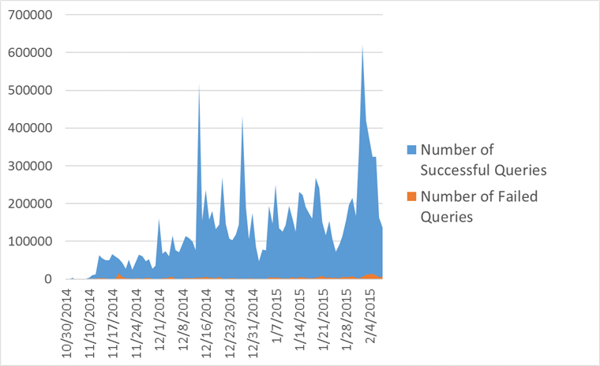

# Improving interoperability with DOM L3 XPath

[ieblog](https://social.msdn.microsoft.com/profile/ieblog) 3/19/2015
10:59:12 AM

-----

As part of our ongoing focus on interoperability with the modern Web,
we’ve been working on addressing an interoperability gap by writing an
implementation of [DOM L3
XPath](http://www.w3.org/TR/DOM-Level-3-XPath/Overview.html) in the
Windows 10 Web platform. Today we’d like to share how we are closing
this gap in Project Spartan’s new rendering engine with data from the
modern Web.

# Some History

Prior to IE’s support for DOM L3 Core and native XML documents in IE9,
[MSXML](https://msdn.microsoft.com/en-us/library/ms763742\(v=vs.85\).aspx)
provided any XML handling and functionality to the Web as an ActiveX
object. In addition to XMLHttpRequest, MSXML supported the XPath
language through its own APIs, selectSingleNode and selectNodes. For
applications based on and XML documents originating from MSXML, this
works just fine. However, this doesn’t follow the W3C standards for
interacting with XML documents or exposing XPath.

To accommodate a diversity of browsers, sites and libraries wrap XPath
calls to switch to the right implementation. If you search for XPath
examples or tutorials, you’ll immediately find results that check for
IE-specific code to use MSXML for evaluating the query in a
non-interoperable way:

In our new rendering engine, the script engine executes modern Web
content, so a plugin-free, native implementation of XPath is required.

# Evaluating the Options

We immediately began to cost the work to implement the entire feature.
Our options included starting from scratch, integrating MSXML, or
porting
[System.XML](https://msdn.microsoft.com/en-us/library/system.xml.xpath\(v=vs.110\).aspx),
but each of these was too costly for its own reasons. We decided to
start implementing a subset of XPath while working on the full
implementation at the same time.

In order to know what subset of the standard to support, we used an
internal crawler that captured the queries used across hundreds of
thousands of the most popular sites on the Web. We found buckets of
queries that had the form

  - //element1/element2/element3
  - //element\[@attribute="value"\]
  - .//\*\[contains(concat(" ", @class, " "), " classname ")\]

Each of these queries maps cleanly to a CSS Selector that could return
the same results that would be returned from our performant Selectors
API. Specifically, the queries above can be converted to

  - element1 \> element2 \> element3
  - element\[attribute="value"\]
  - \*.classname

The first native implementation of XPath thus involved supporting
queries that can be converted to a CSS selector and exposing the results
through the DOM L3 XPath interface objects. Alongside this
implementation, we added telemetry to measure the rate of success across
broader Web usage, which accounted for the number of successful queries,
number of failed queries, and the query string of the first failure.

Our telemetry from internal testing showed that 94% of queries
successfully converted to selectors to unblock many Web sites. Of the
failures reported through the telemetry, many took the form

  - //element\[contains(@class, "className")\]
  - //element\[contains(concat(" ", normalize-space(@class), " "), "
    className ")\]

which can both be converted to the selector “element.className.” With
these additional changes, the success rate improved to 97%, making our
new engine ready for broader usage to support the modern
Web.

|                                                                                                                                                                                                                                                                      |
| -------------------------------------------------------------------------------------------------------------------------------------------------------------------------------------------------------------------------------------------------------------------- |
|  |
| *Internal telemetry showing Xpath query success rates*                                                                                                                                                                                                               |

# Addressing the Remainder

While this supports the vast majority of the Web, converting XPath
queries to Selectors is inherently limited. Additionally, we were still
left with the 3% of failing queries that require support of more of
XPath’s grammar, such as functions, support for non-element and document
nodes, and more complex predicates. Several sites mention various
polyfills for XPath, including [Mozilla Development
Network](https://developer.mozilla.org/en-US/docs/Web/XPath), for
platforms that do not provide adequate support for XPath. One of the
polyfills commonly cited is
[wicked-good-xpath](http://code.google.com/p/wicked-good-xpath/) (WGX),
which is an implementation of XPath written purely in JavaScript.
Running WGX against our internal set of tests across the XPath spec
showed 91% compatibility with competitor native implementations. The
idea of using WGX as a fallback for the remaining 3% became a compelling
bet because it was performant and our tests already measured its
functionality against other implementations. Further, wicked-good-xpath
is an open source project under the MIT license, and our usage of it
would align with our goals to embrace and contribute back to code from
the open source community. However, JavaScript had never been used
within IE to build this kind of platform feature before.

In order to support WGX without polluting a Web page’s context, we
created a separate, isolated script engine dedicated to WGX. With a few
modifications to WGX that provide entry points for invoking functions
and accessing results, we marshal the data from the page to the isolated
engine and evaluate expressions with WGX. With WGX enabled to handle
native XPath queries, we see immediate gains from sites missing content
in our new engine rendering the modern Web.

*Before and after: Available prices for products now appear correctly on
tomtom.com*

*Before and after: Lottery numbers now correctly display where they were
previously missing*

While browsing the Web with WGX, we found a few bugs that exhibit
behavior which diverges from other browsers’ implementations as well as
the W3C spec. We plan to make contributions back to the project that
make WGX more interoperable with native implementations.

Our new rendering engine now has support for XPath to run the modern Web
to enable more functionality and show more content for our customers.
With data-driven development from the modern Web, we landed on a
data-driven outcome of a low-cost and performant implementation on
existing technologies and standards as well as open source code. Grab
the latest flight of the [Windows 10 Technical
Preview](http://insider.windows.com/) to try for yourself\! You can
reach us with feedback via the [Internet Explorer Platform Suggestion
Box](https://wpdev.uservoice.com/forums/257854-internet-explorer-platform)
on UserVoice, [@IEDevChat](https://twitter.com/iedevchat) on Twitter,
and in the comments below.

– Thomas Moore, Software Engineer, Internet Explorer Platform
